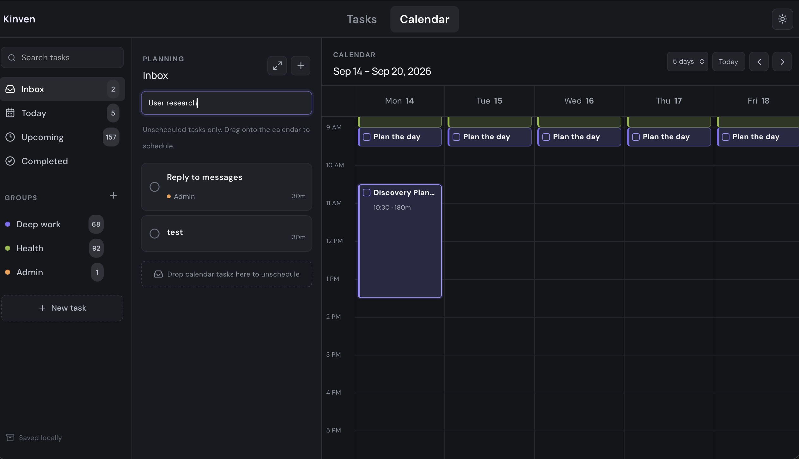

# Kinven

Kinven is a local-first task and calendar planner for turning loose tasks into an actual week. It focuses on the moment where a to-do list stops being useful: deciding what belongs in the inbox, what deserves calendar time, and what can move when the day changes.



I wanted to make planning feel closer to arranging time than managing a database, so the calendar view keeps an unscheduled planning pane next to the week grid. After using it, I changed the sidebar filters so Inbox, Today, Upcoming, Completed, and groups retarget that planning pane while the calendar stays open, which made drag-to-schedule planning much faster.

Tasks, groups, and calendar blocks live in your browser via `localStorage`. This GitHub repo is the source code only - there is no hosted Kinven website.

**Setup:** see [SETUP.md](SETUP.md).

## Run it on your computer

```bash
npm install
npm run dev
```

Vite prints a local address, usually `http://127.0.0.1:5173`. Open that in a browser **on the same computer**. `127.0.0.1` means localhost: it is not public, and clicking it from GitHub will not load the app for anyone else.

## Scripts

- `npm run dev` - start the local app
- `npm run build` - production build
- `npm run preview` - preview the production build
- `npm test` - run the regression suite
- `npm run lint` - run Oxlint
- `npm run security:check` - run lint, tests, build, and high-severity dependency audit

## Data storage

Kinven stores app data under `kinven-local-v1` and theme preference under `kinven-theme`. Older local builds migrate automatically from `aftertone-local-v1` and `aftertone-theme`.

## Deployment headers

The Vite preview server, Netlify-style static deployments, and Vercel deployments are configured with the same production security headers: CSP, `frame-ancestors 'none'`, `X-Content-Type-Options: nosniff`, `Permissions-Policy`, referrer policy, and COOP. If you deploy to a host that ignores `public/_headers` and `vercel.json` (for example GitHub Pages), configure equivalent headers in that platform or at the CDN/proxy layer before publishing publicly.

## Security

See [SECURITY.md](SECURITY.md) to report a vulnerability. GitHub Actions runs tests, lint, `npm audit`, CodeQL, and a secrets scan on `main`.

For first-time GitHub publishing steps and repository protection settings, see [docs/GITHUB_SECURITY.md](docs/GITHUB_SECURITY.md).

## Change log

See `CHANGELOG.md` for numbered, reversible local changes.
